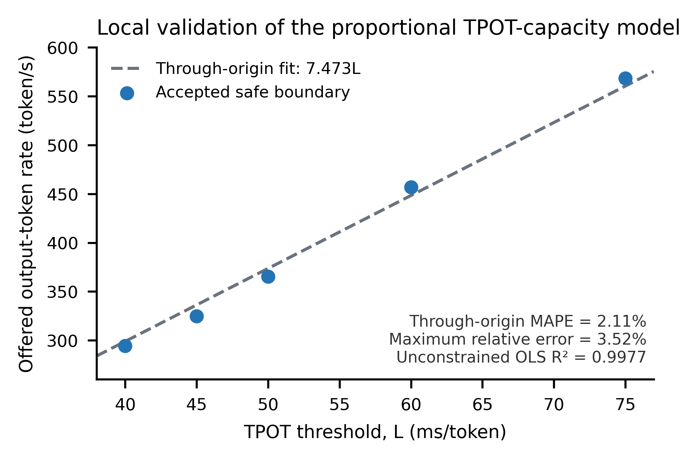

# Detailed Parameter Settings for the Case Study

This document details the parameter settings used in the case study of ***Spatial LLM Workload Shifting Needs Foresight: Model Commitment for Demand Response in AI Inference Data Centers*** and the reasons for their selection.
These settings are primarily informed by published literature, open datasets, publicly available technical reports, and empirical testing.

## 1. System settings

We consider three data centers, assumed to be located in the northeastern, western, and southern United States. 
Their electricity costs are derived from three publicly available price series: 
the ISO New England final real-time LMP at the Internal Hub [1],
the CAISO Fifteen-Minute Market LMP at DLAP_PGAE-APND [2],
and the ERCOT real-time settlement price at HB_NORTH [3].
Each data center has 24,576 NVIDIA H100 GPUs, consistent with the scale of Meta's reported H100-based AI clusters [4].
The hardware specifications of the H100 GPU are taken from the corresponding NVIDIA product report [5].
The power usage effectiveness (PUE) of all three data centers is set to 1.09, consistent with the value reported by Google [6].

## 2. Model and deployment settings

The request load profile is derived from BurstGPT [7], a publicly available dataset containing real-world workload traces from Azure OpenAI GPT services.

**Loading time**: The model-weight counts follow the corresponding model reports [8–11]. Loading time denotes the total elapsed time from launch until a replica becomes service-ready, including checkpoint transfer and post-load initialization [12–15].
Specifically, a public vLLM trace reports a 35 s checkpoint-loading stage for a Qwen-derived 32B BF16 deployment and separately records profiling, compilation, and CUDA-graph capture [15]. The resulting 240 s total lies within the 3–7 min production deployment range reported for representative 27–35B models [14]. ServerlessLLM reports an 84 s conventional loading point for LLaMA-2-70B [12], while a production report places Llama-3-70B deployments in a 4–12 min range, supporting the selected 600 s total [14]. For DeepSeek-R1-671B, a production MaaS study reports approximately one hour from launch to service [13], supporting the selected 3,600 s total.

| Model | Model weights | Total loading time ($T^{rd}_{m,n}$) | Unserved-token penalty ($\pi_m$) |
|---|---:|---:|---:|
| Qwen2.5-32B | 32.5B parameters [8] | 240 s [14,15] | $8.00\times10^{-7}$ USD/token [16] |
| Llama-3.3-70B | 70B parameters [9] | 600 s [12,14] | $8.74\times10^{-7}$ USD/token [16] |
| DeepSeek-V3 | 671B parameters [10,11] | 3,600 s [13] | $2.66 \times 10^{-6}$ USD/token [16] |

The model-specific values of $\pi_m$ are the unserved-token penalty coefficients used directly in the objective function. They are derived from standard on-demand API prices [16] and account for both input and output tokens using the mean token-length ratios in BurstGPT [7].

## 3. Service-level settings

### TTFT-related parameter settings

| Parameter | Definition | Qwen2.5-32B | Llama-3.3-70B | DeepSeek-V3 |
|---|---|---:|---:|---:|
| $L_m^{\mathrm{TTFT}}$ | Mean-TTFT limit | 2 s | 2 s | 2 s |
| $L_m^{\mathrm{TPOT}}$ | TPOT limit | 50 ms | 50 ms | 50 ms |
| $R_m^{\max}$ | Maximum output-token throughput of one replica | 1,417.47 token/s | 4,669.86 token/s | 266,400 token/s |
| $\rho_m^{\mathrm{TPOT}}L_m^{\mathrm{TPOT}}$ | Fraction of $R_m^{\max}$ available under the 50-ms TPOT limit | 0.47500 | 0.89177 | 1.00000 |

The TTFT limit $L_m^{\mathrm{TTFT}}=2$ s and the TPOT limit $L_m^{\mathrm{TPOT}}=50$ ms are consistent with the service targets reported for practical serving systems [17,18]. The maximum throughput $R_m^{\max}$ and $\rho_m^{\mathrm{TPOT}}$ are derived from [5,11,19,20].
Furthermore, we validated the assumed linear relationship between SLO-compliant output-token capacity and the TPOT limit (Eq. (12) of the manuscript): 

$$\sum_r q_{r,m,n,t} \le (\rho_m^{TPOT} L_m^{TPOT} ) \cdot R_m^{\max} \cdot \widetilde{x}_{m,n,t} \cdot \Delta t $$

We evaluated five TPOT thresholds using Qwen2.5-72B: 40, 45, 50, 60, and 75 ms. At each threshold, a run was accepted only if all requests completed successfully and the queue remained stable, with experiments repeated across three random seeds.
A total of 46,900 requests drawn from publicly available benchmark datasets were evaluated.
As shown in the figure, the SLO-compliant output-token capacity increased approximately linearly with the TPOT limit over the tested 40–75 ms range.

## References

[1] ISO New England, “Final Real-Time Hourly Locational Marginal Prices, 22 July 2024,” official market record, 2024.

[2] California Independent System Operator, “Business Practice Manual for Market Instruments,” version 91.2, 2025; and “OASIS FMM Locational Marginal Prices, Trading Date 22 July 2024,” official market record, 2024.

[3] Electric Reliability Council of Texas, “Real-Time Settlement Point Prices Display, Operating Day 7 November 2024,” official market record, 2024.

[4] Meta Engineering, “Building Meta's GenAI Infrastructure,” technical report, 12 March 2024.

[5] NVIDIA Corporation, “NVIDIA H100 Tensor Core GPU,” product brief PB-11133-001, 2022.

[6] Google, “2025 Environmental Report,” 2025. The report presents environmental metrics for fiscal year 2024.

[7] Y. Wang, Y. Chen, Z. Li, X. Kang, Z. Tang, X. He, R. Guo, X. Wang, Q. Wang, A. C. Zhou, and X. Chu, “BurstGPT: A Real-world Workload Dataset to Optimize LLM Serving Systems,” arXiv:2401.17644, 2024.

[8] Qwen Team, “Qwen2.5 Technical Report,” arXiv:2412.15115, 2024; and “Qwen2.5-32B-Instruct Model Card,” 2024.

[9] Meta, “Llama 3.3 Model Card,” 2024.

[10] DeepSeek-AI, “DeepSeek-V3 Technical Report,” arXiv:2412.19437, 2024.

[11] DeepSeek-AI, “DeepSeek-V3/R1 Inference System Overview,” technical report, February 2025.

[12] Y. Fu, L. Xue, Y. Huang, A.-O. Brabete, D. Ustiugov, Y. Patel, and L. Mai, “ServerlessLLM: Low-Latency Serverless Inference for Large Language Models,” in *18th USENIX Symposium on Operating Systems Design and Implementation (OSDI 24)*, 2024, pp. 135–153.

[13] Y. Liu, H. Li, X. Huang, Y. Wang, H. Guo, H. Chen, Y. Ren, and N. Jia, “Accelerating Model Loading in LLM Inference by Programmable Page Cache,” in *24th USENIX Conference on File and Storage Technologies (FAST 26)*, 2026, pp. 117–132.

[14] N. Suryadevara, T. Cui, W. Van Eaton, and C. Zedlewski, “The Production Platform for Open-Weight AI Inference,” Together AI technical report, 23 July 2026.

[15] vLLM Project, “RuntimeError: Engine Core Initialization Failed for vLLM 0.8.x,” public deployment trace, issue 17939, May 2025.

[16] DeepInfra, “Simple Pricing, Deep Infrastructure,” standard on-demand model-pricing record, prices observed 28 July 2026.

[17] F. Bai, P. Peng, Z. Tang, Z. Wang, G. Chen, X. Lu, Y. Li, H. Lin, W. Lin, Y. Wang, and X. Li, “EPD-Serve: A Flexible Multimodal EPD Disaggregation Inference Serving System on Ascend,” arXiv:2601.11590, 2026.

[18] A. Xiao et al., “Huawei Cloud Model-as-a-Service on the CloudMatrix384 SuperPod,” arXiv:2508.02520, revised 2026.

[19] NVIDIA Corporation, “Performance: Llama-3.3-70B-Instruct Results,” *NVIDIA NIM LLMs Benchmarking*, container version 1.5.0, technical documentation, accessed 30 August 2026.

[20] NVIDIA Corporation, “NVIDIA Ada GPU Architecture,” white paper, version 2.02, 2023.
